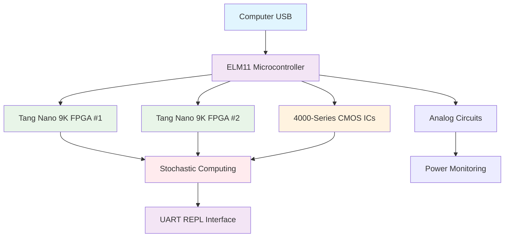
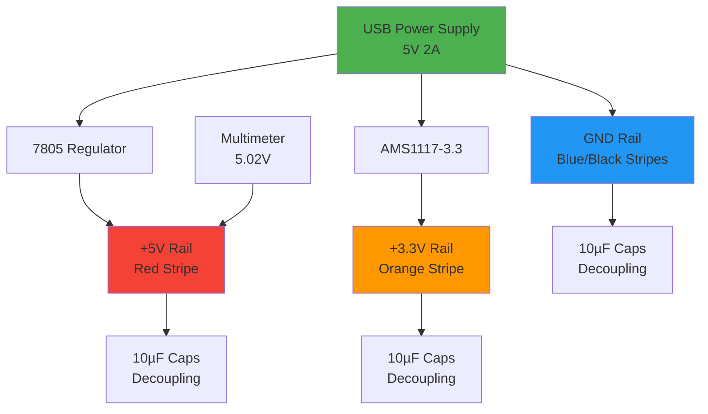
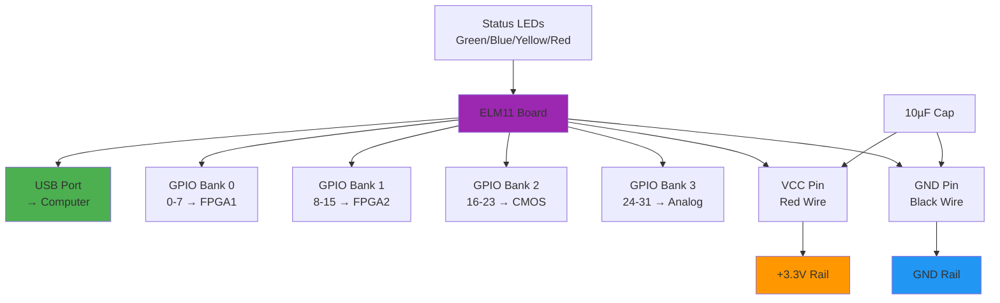
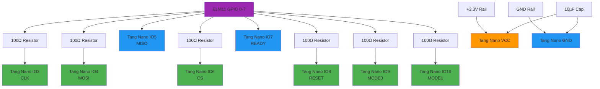
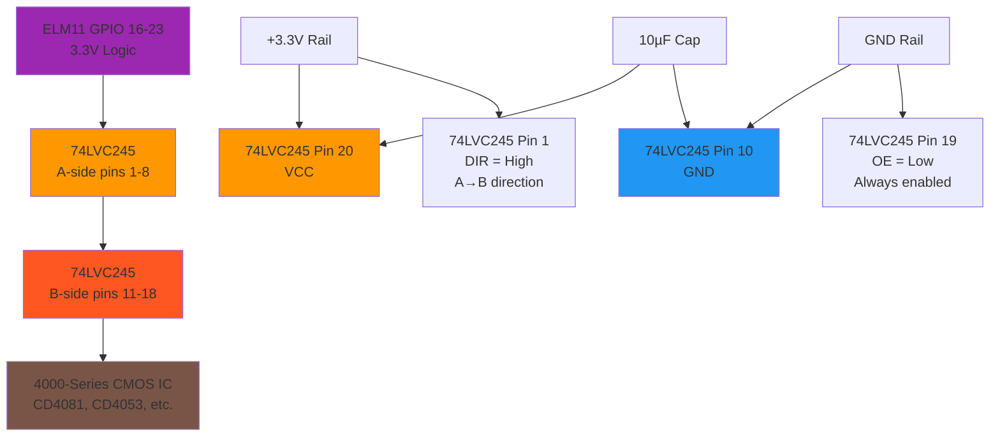
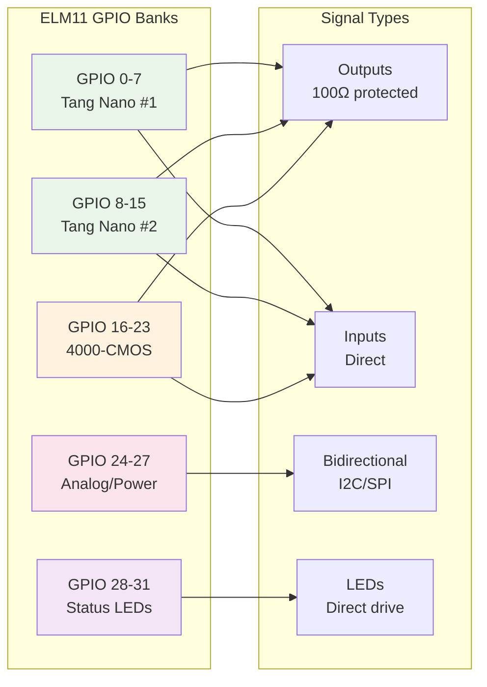
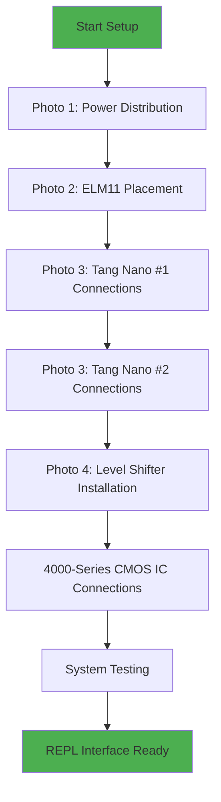

# Stochastic Computing Hardware Setup - Photo Descriptions for Google Gemini

## System Block Diagram

## Photo 1: Power Distribution Setup

**Description for Image Generation:**
Create a detailed photograph of a breadboard setup showing power distribution for a stochastic computing system. Show a large solderless breadboard with red, blue, and black power rails clearly visible. The +5V rail should be connected to a USB power supply or voltage regulator, the +3.3V rail should show a voltage regulator circuit, and the GND rail should be connected to the power supply ground. Include several 10µF electrolytic capacitors placed near the power rails for decoupling. Show jumper wires connecting the power rails to various points on the breadboard. Include a digital multimeter measuring the voltage on the +5V rail, showing a reading around 5.0V. The breadboard should be clean and well-organized with no components yet installed, just the power infrastructure. Use realistic lighting and focus on the power rails and connections.

**Key Elements to Include:**
- Large solderless breadboard (830-point or similar)
- Red stripe for +5V rail, blue/black for GND rails
- USB power input or 7805 voltage regulator
- AMS1117-3.3 or similar 3.3V regulator
- Multiple 10µF capacitors on power rails
- Multimeter displaying voltage measurement
- Clean, professional wiring with no shorts

## Photo 2: ELM11 Board Placement

**Description for Image Generation:**
Create a detailed photograph showing an ELM11 microcontroller board mounted on a breadboard. The ELM11 should be oriented with its USB port facing the edge of the breadboard for easy access. Show the 32 GPIO pins (divided into banks 0-3) inserted into the breadboard sockets. Include power connections: a red wire from the ELM11 VCC pin to the +3.3V power rail, and a black wire from GND to the ground rail. Add a 10µF decoupling capacitor between VCC and GND pins on the ELM11. Show the board's status LEDs (if visible) and the USB connector clearly. The breadboard should have the power rails established from Photo 1. Include a small ruler or measurement reference to show scale. Use realistic lighting showing the components clearly.

**Key Elements to Include:**
- ELM11 board with RISC-V processors and Lua firmware
- USB port oriented toward breadboard edge
- 32 GPIO header pins inserted into breadboard
- Red wire: ELM11 VCC → +3.3V rail
- Black wire: ELM11 GND → GND rail
- 10µF capacitor near ELM11 power pins
- Clean breadboard with established power rails
- Professional component placement

## Photo 3: Tang Nano FPGA Connections

**Description for Image Generation:**
Create a detailed photograph showing a Tang Nano 9K FPGA board connected to an ELM11 microcontroller via GPIO wires. Show 8 signal wires connecting ELM11 GPIO pins 0-7 to Tang Nano IO pins 3-10. Include 100 ohm current-limiting resistors on each output line from ELM11 (GPIO0,1,3,5,6,7). Show bidirectional connections without resistors for input lines (GPIO2,4). Include power connections: red wire from +3.3V rail to Tang Nano VCC, black wire to GND. Add a 10µF decoupling capacitor near the Tang Nano power pins. Show wire labels or color coding indicating the signal names (CLK, MOSI, MISO, CS, READY, RESET, MODE0, MODE1). The ELM11 should be mounted as in Photo 2. Use close-up photography to clearly show the connections and components.

**Key Elements to Include:**
- Tang Nano 9K FPGA board with GW1NR-9 FPGA chip
- ELM11 board with GPIO connections
- 8 jumper wires with 100Ω resistors on outputs
- Color-coded wires indicating signal functions
- Power connections with decoupling capacitor
- Professional wiring with strain relief
- Clear visibility of both boards and connections
- Close-up view showing pin connections

## Photo 4: Level Shifter Installation

**Description for Image Generation:**
Create a detailed photograph showing a 74LVC245 level shifter IC installed on a breadboard, bridging 3.3V and 5V logic levels. Show the DIP-20 package inserted into the breadboard with clear pin numbering visible. Include connections from ELM11 GPIO pins 16-23 (A-side) to the level shifter A-pins (1-8), and from level shifter B-pins (11-18) to 4000-series CMOS IC pins. Show the direction control: pin 1 (DIR) tied to VCC for A-to-B translation. Show pin 19 (OE) tied to GND for always-enabled operation. Include power connections: pin 20 (VCC) to +3.3V rail, pin 10 (GND) to ground. Show a 4000-series CMOS IC (like CD4081) connected to the B-side outputs. Include decoupling capacitors near power pins. Use detailed, close-up photography to show the IC pin connections clearly.

**Key Elements to Include:**
- 74LVC245 level shifter in DIP-20 package
- Clear pin numbering and orientation
- A-side connections to ELM11 GPIOs (3.3V logic)
- B-side connections to CMOS ICs (5V logic)
- Direction control pin tied appropriately
- Power and ground connections
- 4000-series CMOS IC connected to outputs
- Decoupling capacitors
- Professional component placement and wiring
- Close-up view showing IC details

## GPIO Pin Mapping Summary

## Complete System Wiring Flow

